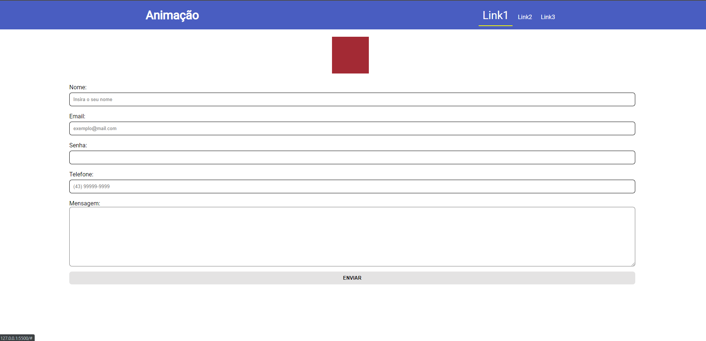
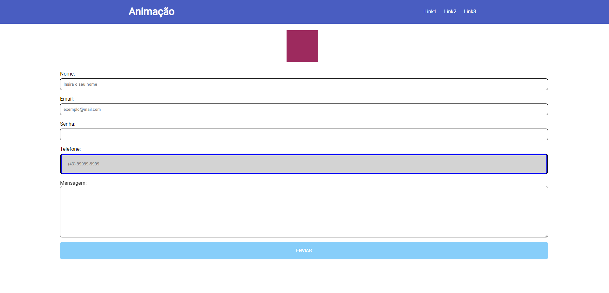

# Exemplos sobre Transição e Animações 

Exemplos aplicados em aula sobre como realizar animações e transições no CSS.

## Através desse exemplo, será possível treinar sobre:
* Pseudo Classes (Hover e Focus)
* Transitions
* Animations (@Keyframes)

## Projeto Base:
Para baixar os arquivos base do projeto para praticar (somente a estrutura HTML e CSS do projeto sem as animações e transições aplicadas) acessar a branche: **estrutura-inicial**:
 - [estrutura-inicial](https://github.com/wendelcutrim/exemplo-animacoes-transicoes/tree/estrutura-inicial)

Para realizar os exercícios, basta abrir o arquivo: **exercicios.todo**

Recomendo baixar a extensão **Todo+ do autor Fabio Spampinato** para ter uma melhor experiência com este arquivo.

Após instalar a extensão, basta ir na linha do arquivo que finalizou o exercício e pressionar as teclas: **ALT + D** para marcar como finalizado o checkbox.

## Tecnologias Utilizadas:
- ``HTML``
- ``CSS``

## Imagens do projeto:

### Autores:
- [@wendelcutrim](https://www.github.com/wendelcutrim)
